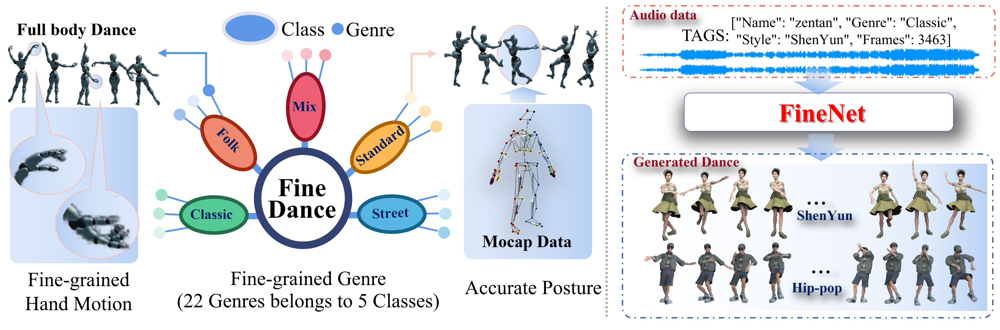

# [FineDance: A Fine-grained Choreography Dataset for 3D Full Body Dance Generation (ICCV 2023)](https://github.com/li-ronghui/FineDance)

[[Project Page](https://li-ronghui.github.io/finedance)] | [[Preprint](https://arxiv.org/abs/2302.03665)] | [[pdf](https://arxiv.org/pdf/2212.03741.pdf)] | [[video](https://li-ronghui.github.io/finedance)]


## Teaser



## Dataset

### Download

The part(7.7 hours) of FineDance dataset can be downloaded at [Google Drive](https://drive.google.com/file/d/1zQvWG9I0H4U3Zrm8d_QD_ehenZvqfQfS/view?usp=sharing)

### Descriptions
The data directory is organized as follows:

label_json: contains the song name, coarse style and fine-grained genre.

motion: contains the [SMPLH](https://smpl-x.is.tue.mpg.de/) format motion data.   

music_wav: contains the music data in 'wav' format.

music_npy: contains the music feature extracted by [librosa](https://github.com/librosa/librosa) follow [AIST++](https://github.com/google/aistplusplus_api/tree/main)

Here is an example python script to read the motion file
```python
import numpy as np
data = np.load("motion/001.npy")
T, C = data.shape           # T is the number of frames
smpl_poses = data[:, 3:]
smpl_trans = data[:, :3]
```


### Dataset split

We spilt FineDance dataset into train, val and test sets in two ways: FineDance@Genre and  FineDance@Dancer. Each music and paired dance are only present in one split. 

1. The test set of FineDance@Genre includes a broader range of dance genres, but the same dancer appear in  train/val/test set. Although the training set and test set include the same dancers, the same motions do not appear in both the training and testing sets. This is because these dancers do not have distinct personal characteristics in their dances.
2. The train/val/test set of FineDance@Dancer was divided by different dancers, which test set contains fewer dance genres, yet the same dancer won't appear in different sets.

If you use this dataset for dance generation, we recommend you to use the split of FineDance@Genre.


## Acknowledgments
We would like to express our sincere gratitude to Dr [Yan Zhang](https://yz-cnsdqz.github.io/) and [Yulun Zhang](https://yulunzhang.com/) for their invaluable guidance and insights during the course of our research.

## Citation
When using the code/figures/data/video/etc., please cite our work
```
@inproceedings{li2023finedance,
  title={FineDance: A Fine-grained Choreography Dataset for 3D Full Body Dance Generation},
  author={Li, Ronghui and Zhao, Junfan and Zhang, Yachao and Su, Mingyang and Ren, Zeping and Zhang, Han and Tang, Yansong and Li, Xiu},
  booktitle={Proceedings of the IEEE/CVF International Conference on Computer Vision},
  pages={10234--10243},
  year={2023}
}
```
